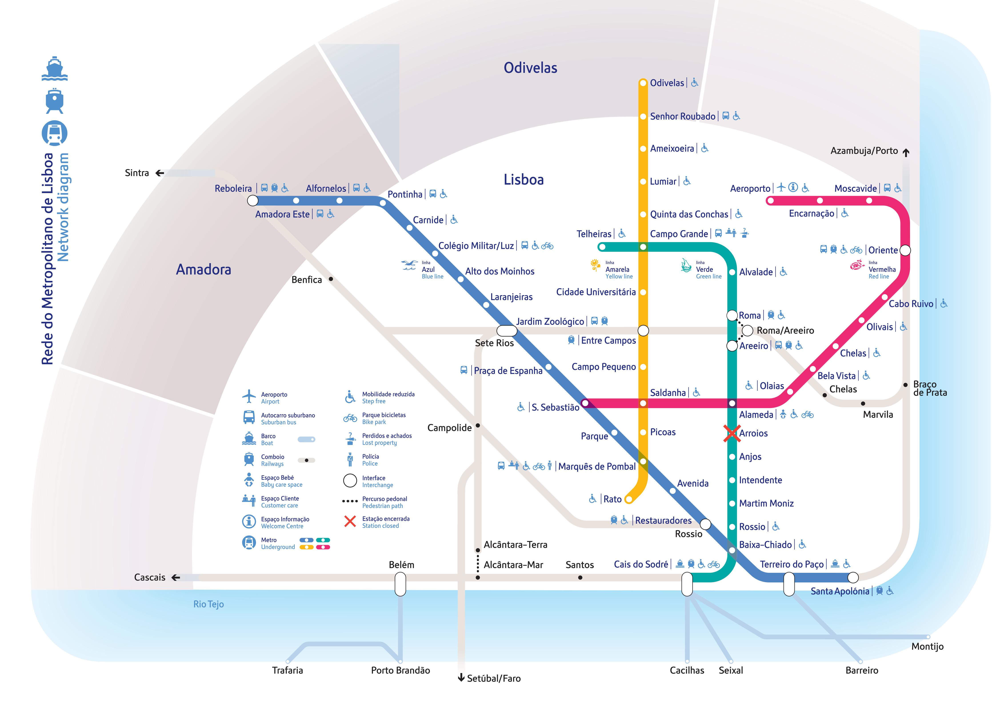
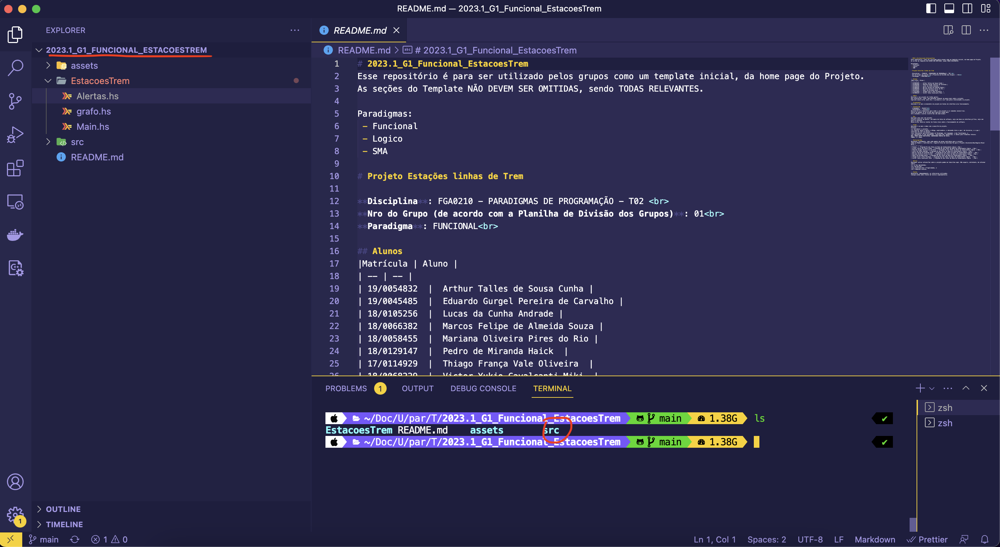

# 2023.1_G1_Funcional_EstacoesTrem
Esse repositório é para ser utilizado pelos grupos como um template inicial, da home page do Projeto.
As seções do Template NÃO DEVEM SER OMITIDAS, sendo TODAS RELEVANTES.

Paradigmas:
 - Funcional
 - Logico
 - SMA

# Projeto Estações linhas de Trem

**Disciplina**: FGA0210 - PARADIGMAS DE PROGRAMAÇÃO - T02 <br>
**Nro do Grupo (de acordo com a Planilha de Divisão dos Grupos)**: 01<br>
**Paradigma**: FUNCIONAL<br>

## Alunos
|Matrícula | Aluno |
| -- | -- |
| 19/0054832  |  Arthur Talles de Sousa Cunha |
| 19/0045485  |  Eduardo Gurgel Pereira de Carvalho |
| 18/0105256  |  Lucas da Cunha Andrade |
| 18/0066382  |  Marcos Felipe de Almeida Souza |
| 18/0058455  |  Mariana Oliveira Pires do Rio |
| 18/0129147  |  Pedro de Miranda Haick  |
| 17/0114929  |  Thiago França Vale Oliveira  |
| 18/0068229  |  Victor Yukio Cavalcanti Miki  |

## Sobre 
O projeto se baseia na reimplementação em Haskell do projeto disponível [aqui](https://github.com/projeto-de-algoritmos/Grafos1_Trem).

"O objetivo consiste na implementação de estações de trem em grafos. O projeto possibilita os usuários conhecer a menor rota entre as estações, assim como o caminho percorrido entre elas."



## Screenshots
### Menu Principal

### Estações


## Instalação 
**Linguagens**: Haskell<br>
**Tecnologias**: GHCup<br>
Descreva os pré-requisitos para rodar o seu projeto e os comandos necessários.
```
Clonar repositorio 
'git clone https://github.com/UnBParadigmas2023-1-Turma02/2023.1_G1_Funcional_EstacoesTrem'
```

Para executar o programa é importante instalar o [GHCup](https://www.haskell.org/ghcup/) e seguir o guia de configuração para enfim interpretar ou compilar definições de tipos e funções em tempo de execução.

Assumindo que Já tenha clona o repositório garanta que está dentro do repositório e acesse a pasta src

> $ cd src




Agora que está dentro dos arquivos vamos executar o programa com o comando:

> $ ghc --run Main.hs

Ele deve executar a aplicação de forma interpretada.

<!-- 

Por fim, digite a função principal do arquivo digitando o comando:

> $ ghci> main

Uma vez que seguir esses passos basta selecionar as ações que desejar e brincar com as estações de trem.


Para sair digite "7" para selecionar a opção de saida e prossiga com o comando:

> $ :q

para sair do interpretador interativo GHCi. -->

## Uso 

A aplicação consiste num menu simples com opções enumeradas.


ATENÇÃO: Nas funções de cálculo de caminho e distância, selecione as estações pelos índices disponíveis de 0 a 48, a fim de evitar comportamentos inesperados (caso tenha dúvidas sobre quais estações possuem quais índices, é possível usar a função 1 (Listar Estações) e correlacionar com os nomes no mapa disponível na seção "Sobre").

## Vídeo
Adicione 1 ou mais vídeos com a execução do projeto.
Procure: 
(i) Introduzir o projeto;
(ii) Mostrar passo a passo o código, explicando-o, e deixando claro o que é de terceiros, e o que é contribuição real da equipe;
(iii) Apresentar particularidades do Paradigma, da Linguagem, e das Tecnologias, e
(iV) Apresentar lições aprendidas, contribuições, pendências, e ideias para trabalhos futuros.
OBS: TODOS DEVEM PARTICIPAR, CONFERINDO PONTOS DE VISTA.
TEMPO: +/- 15min

## Participações
Apresente, brevemente, como cada membro do grupo contribuiu para o projeto.
|Nome do Membro | Contribuição | Significância da Contribuição para o Projeto (Excelente/Boa/Regular/Ruim/Nula) |
| -- | -- | -- |
| Arthur Talles de Sousa Cunha  | Programação dos Fatos da Base de Conhecimento Lógica  | Boa |
| Eduardo Gurgel Pereira de Carvalho  | Programação dos Fatos da Base de Conhecimento Lógica  | Boa |
| Lucas da Cunha Andrade  | Programação dos Fatos da Base de Conhecimento Lógica  | Boa |
| Marcos Felipe de Almeida Souza  | Programação dos Fatos da Base de Conhecimento Lógica  | Boa |
| Mariana Oliveira Pires do Rio  | Programação dos Fatos da Base de Conhecimento Lógica  | Boa |
| Pedro de Miranda Haick  | Algoritmo de busca DFS e funções relacionadas | Boa |
| Thiago França Vale Oliveira  | Programação dos Fatos da Base de Conhecimento Lógica   | Boa |
| Victor Yukio Cavalcanti Miki  | Fiz pareamento com o Lucas Andrade e Implementamos o algoritmo BFS e o printDistancia e documentei o passo-a-passo para executar o projeto.  | Boa |

## Outros 
Quaisquer outras informações sobre o projeto podem ser descritas aqui. Não esqueça, entretanto, de informar sobre:
(i) Lições Aprendidas;
(ii) Percepções;
(iii) Contribuições e Fragilidades, e
(iV) Trabalhos Futuros.

## Fontes
Referencie, adequadamente, as referências utilizadas.
Indique ainda sobre fontes de leitura complementares.
