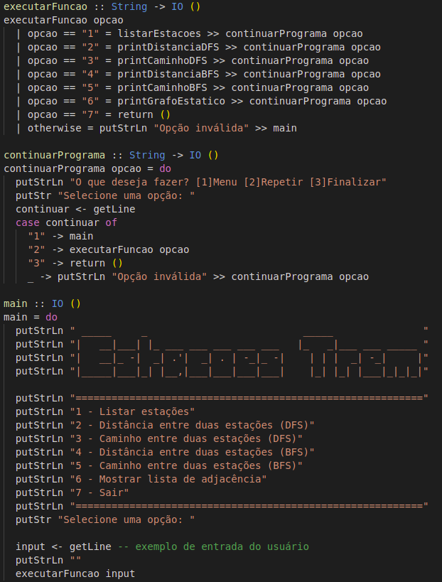
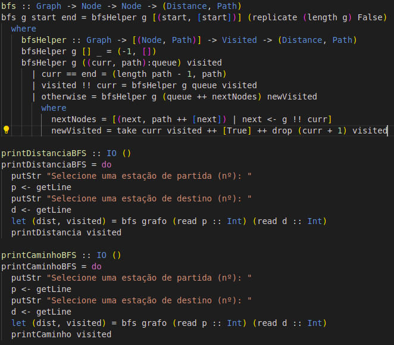
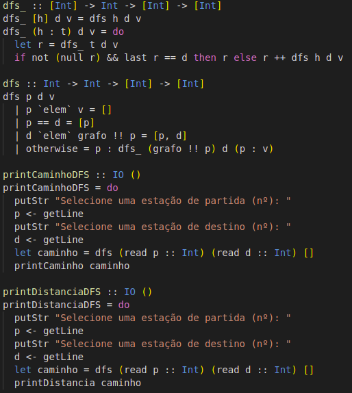

# Funções

O nosso projeto segue o paradigma funcional, sendo assim, funciona a base de funções que possuem determinados objetivos. A seguir estão algumas das principais funções do código.

## Main.hs

O programa não apresenta uma interface frontend e é executado inteiramente no terminal. Por conta disso, e para melhorar a experiência do usuário, nós desenvolvemos um menu para tornar o software um pouco mais interativo. No menu, além da função que o imprime, existem funções que ajudam a navegar pelas funcionalidades e ao terminar de usá-las.

## BFS.hs

Como o porpósito do programa é mostrar os caminhos entre uma estação e outra, nós usamos um algoritmo de BFS para encontrar os possíveis caminhos dentro do grafo. Além de encontrar o melhor caminho, existem funções relacionadas a BFS para imprimir todo o caminho ou apenas a distância.

## DFS.hs

 Além da busca em largura, também é possível encontrar os possíveis caminhos dentro do grafo usando uma DFS. Além de encontrar o melhor caminho, existem funções relacionadas a DFS para imprimir todo o caminho ou apenas a distância.

## Outras

Também existem outras funções espalhadas pelo código, porém a grande maioria está relacionado a inputs e outputs.